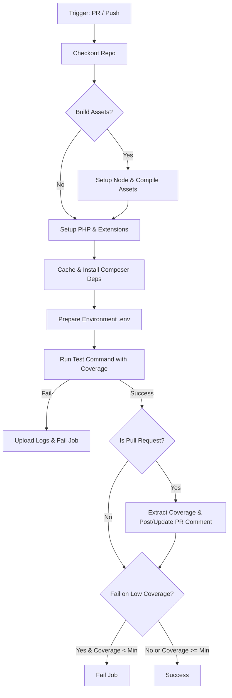

<p align="center">
  
</p>

<h1 align="center">laravel-coverage-comment</h1>

<p align="center">
  <strong>A reusable GitHub Actions workflow to run your Pest test suite, analyze code coverage, and post/update interactive summaries directly on your Pull Requests.</strong>
</p>

<p align="center">
  <a href="https://github.com/ym-actions/laravel-coverage-comment/releases"></a>
  <a href="https://github.com/ym-actions/laravel-coverage-comment/blob/main/LICENSE"></a>
</p>

---

## ✨ Features

- 🚀 **Zero-Config Pest Setup:** Run your Pest test suite out of the box with default PHPUnit-compatible coverage output.
- 💬 **Sticky PR Comments:** Automatically post an interactive summary of your code coverage. Updates the same comment on subsequent commits to prevent Pull Request clutter.
- 📦 **Automated Asset Building:** Auto-detects and runs npm, yarn, pnpm, or bun builds if your tests require compiled frontend assets.
- ⚙️ **Smart Caching:** Automatically caches Composer dependencies to speed up subsequent workflow runs.
- 🚨 **Coverage Guardrails:** Enforce a minimum coverage threshold (`min-coverage`) and optionally fail the build if it is not met.
- 📂 **Log Preservation:** Automatically uploads Laravel logs (`storage/logs`) as an artifact if any tests fail, making debugging easier.

---

## 📊 Workflow Overview



---

## ⚡ Quick Start

To use this workflow in your Laravel application, create a file (e.g., `.github/workflows/ci.yml`) and reference the reusable workflow:

```yaml
name: CI

on:
  pull_request:
    branches: [main]

jobs:
  test:
    uses: ym-actions/laravel-coverage-comment/.github/workflows/main.yml@1.x
    permissions:
      contents: read
      pull-requests: write # REQUIRED to post and update comments on PRs
```

---

## ⚙️ Configuration Reference

### Inputs

| Input                  | Description                                                                   | Type     | Required | Default                                                                      |
| :--------------------- | :---------------------------------------------------------------------------- | :------- | :------- | :--------------------------------------------------------------------------- |
| `php-version`          | PHP version to set up (e.g. `8.2`, `8.3`, `8.4`).                             | `string` | No       | `"8.3"`                                                                      |
| `php-extensions`       | Additional PHP extensions to install.                                         | `string` | No       | `"dom, curl, libxml, mbstring, zip, pcntl, pdo, sqlite, pdo_sqlite, bcmath"` |
| `test-command`         | The command to execute tests and generate coverage.                           | `string` | No       | `"./vendor/bin/pest --ci --coverage"`                                        |
| `coverage-driver`      | PHP extension to use for coverage (`pcov` or `xdebug`).                       | `string` | No       | `"pcov"`                                                                     |
| `min-coverage`         | Minimum coverage percentage required (e.g., `80`).                            | `string` | No       | `"0"`                                                                        |
| `fail-on-low-coverage` | Whether to fail the build if coverage is below `min-coverage`.                | `string` | No       | `"false"`                                                                    |
| `build-assets`         | Compile frontend assets before running tests (`true` or `false`).             | `string` | No       | `"false"`                                                                    |
| `asset-build-command`  | Custom compile command. Use `'auto'` for auto-detection of npm/yarn/pnpm/bun. | `string` | No       | `"auto"`                                                                     |
| `node-version`         | Node version to use if `build-assets` is set to `true`.                       | `string` | No       | `"20"`                                                                       |

---

## 🔧 Advanced Example

Below is a configuration demonstrating asset building, custom PHP version/extensions, and strict coverage enforcement:

```yaml
name: CI

on:
  pull_request:
    branches: [main, develop]
  push:
    branches: [main]

jobs:
  ci:
    uses: ym-actions/laravel-coverage-comment/.github/workflows/main.yml@1.x
    permissions:
      contents: read
      pull-requests: write
    with:
      php-version: "8.4"
      php-extensions: "dom, curl, libxml, mbstring, zip, pcntl, pdo, sqlite, pdo_sqlite, bcmath, redis, gd"
      min-coverage: "85"
      fail-on-low-coverage: "true"
      build-assets: "true"
      node-version: "22"
```

---

## 💡 Tips & Troubleshooting

### PR Comment Permissions

If the action finishes successfully but fails to post comments on your pull request, verify that you have configured the `permissions` section of your job. Reusable workflows require explicit permission delegation:

```yaml
permissions:
  contents: read
  pull-requests: write
```

### Fast Code Coverage

We recommend using the default `pcov` driver. It runs significantly faster than `xdebug` and uses less memory, resulting in shorter runner execution times and lower action costs.

### Environment & Database Preparation

Before executing tests, the workflow checks if `.env.testing` exists and copies it to `.env` (falling back to `.env.example` if not found). It then runs `php artisan key:generate --env=testing`.
Make sure your `.env.testing` is configured to use an in-memory database or a lightweight database file (e.g., SQLite) for your test suite:

```env
DB_CONNECTION=sqlite
DB_DATABASE=:memory:
```

---

## 📄 License

This action is open-sourced under the [MIT License](LICENSE).
